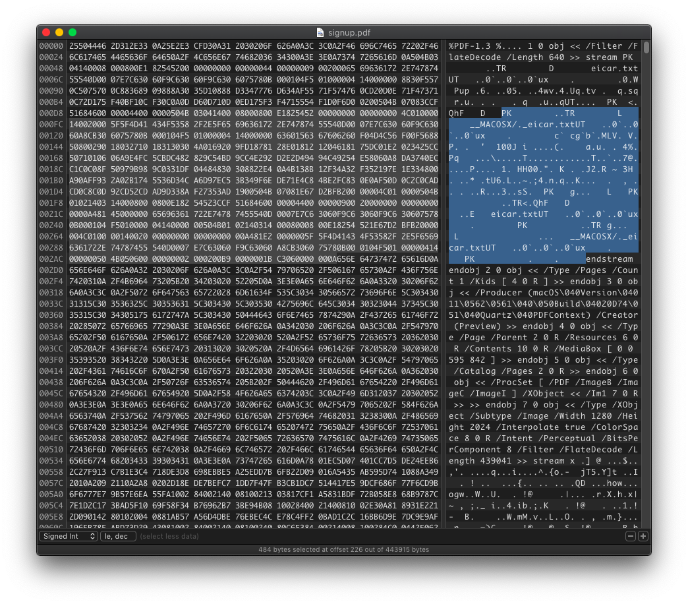
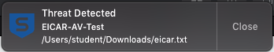

# Is it really?
### TEAM NAME: NYCP

## CATEGORY
Forensics

## DESCRIPTION
Flag format: `WH2021{malicious_file_name}`

## FLAG
`WH2021{eicar.txt}`

## WRITEUP
For PDF forensics, I like to open the file in a hex editor first to see if there is any interesting data hidden in the PDF.

The first thing that catches my eye is the words `eicar.txt`. What is [eicar.txt](https://www.eicar.org/?page_id=3950)? It is an anti-malware test file that is created by European Institute for Computer Anti-Virus Research (EICAR) for antivirus vendors to test if their antivirus software actually works. However, some vendors like [Malwarebytes](https://forums.malwarebytes.com/topic/191650-malwarebytes-3-frequently-asked-questions/) do not block the file as they say it is not representative of current threats.

I try to extract the whole ZIP file to be sure. We know it is a zip file since it matches the magic number of a ZIP file, `50 4B 03 04` This is `eicar.zip` in the current directory. Extracting it triggers my antivirus software. Hence, we got the flag.

