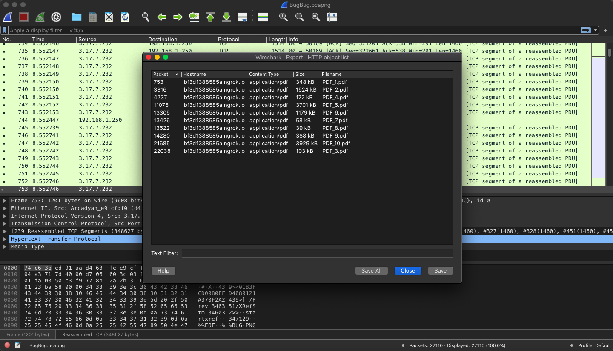
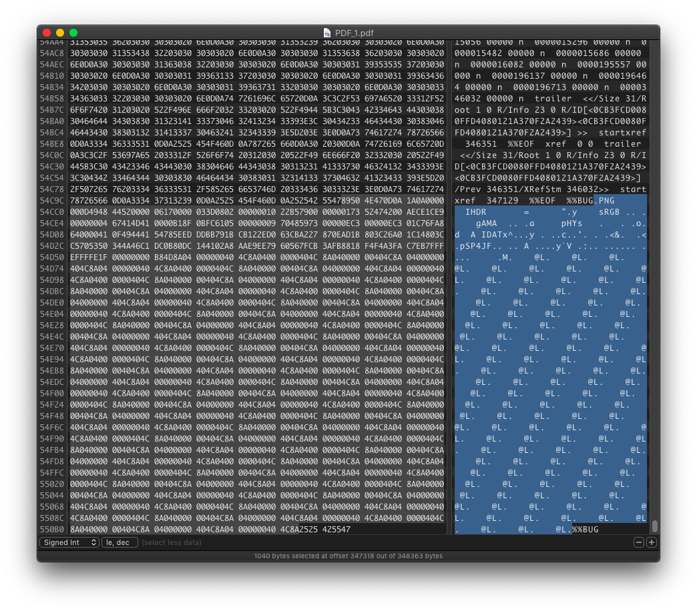
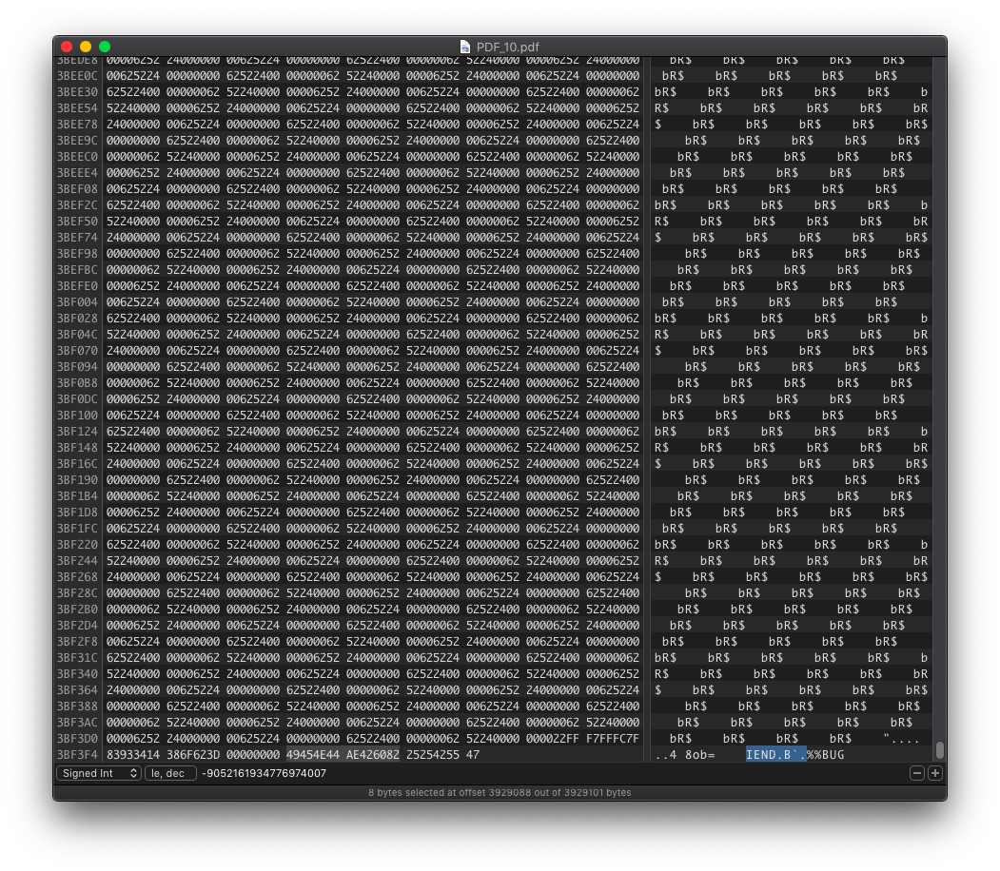

# BugBug Infestation
### TEAM NAME: NYCP

## CATEGORY
GovTech

## DESCRIPTION

## FLAG
`WH2021{B()GBuGL1veSOn}`

## WRITEUP
Since the challenge description mentions that there are some suspicious files being transmitted over the network, we open the `.pcapng` file in Wireshark and search for the packets with these suspicious files. The PDF files are transmitted over the HTTP protocol. To extract all the PDF files, we can go to File > Export Objects > HTTP > Save All. We will get `PDF_1.pdf` through `PDF_10.pdf` in this directory.

We then open the PDF files in a hex editor, and we quickly find references to the title BugBug Infestation, at the end of the file. PDF files offer many opportunities for steganography (the NSA has a [document](http://www.itsecure.hu/library/file/Biztons%C3%A1gi%20%C3%BAtmutat%C3%B3k/Alkalmaz%C3%A1sok/Hidden%20Data%20and%20Metadata%20in%20Adobe%20PDF%20Files.pdf) on it). Since PDF files support incremental updates, we can actually write data beyond the `%%EOF` end of file marker, which is what we see in this challenge.

We also note something interesting in `PDF_1`, the data between the `%%BUG` ... `%%BUG` markers starts with `89 50 4E 47 0D 0A 1A 0A` the magic number for PNG files.

To confirm our suspicions, we look at `PDF_10` and we see that the data ends with `49 45 4E 44 AE 42 60 82` the trailer file signature of PNG files.

This leads us to conclude that the flag is indeed hidden in a PNG file, that can be extracted by concatenating all the data between the `%%BUG` ... `%%BUG` markers from PDF_1 to PDF_10.

We then get the flag:

