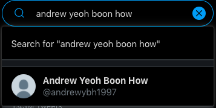
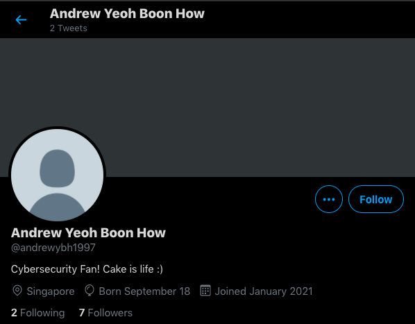

# Birthday Surprise A - Age Unknown
### TEAM NAME: NYCP

## CATEGORY
OSINT

## DESCRIPTION
So, it's my friend's birthday soon and I want to surprise him. His name is Andrew Yeoh Boon How and I heard he's quite active on Twitter. Can you help me find out when is his birthday?

Flag format: `WH2021{DDMMYYYY}`

## FLAG
`WH2021{18091997}`

## WRITEUP
Since the challenge description has a mention of Twitter, we can do a search on Twitter for `Andrew Yeoh Boon How`, which is the only other piece of useful information we have from the challenge description.

We then go to the handle `@andrewybh1997` that was suggested.

From his profile, we can get his birthday `September 18`.

We can infer from the username that his birthyear is `1997`. Many people append their birthyear/ birthday to their social media handle/ email, especially if the particular username they want has been taken.

Combining all the information we have, we can get the flag: `WH2021{18091997}`
