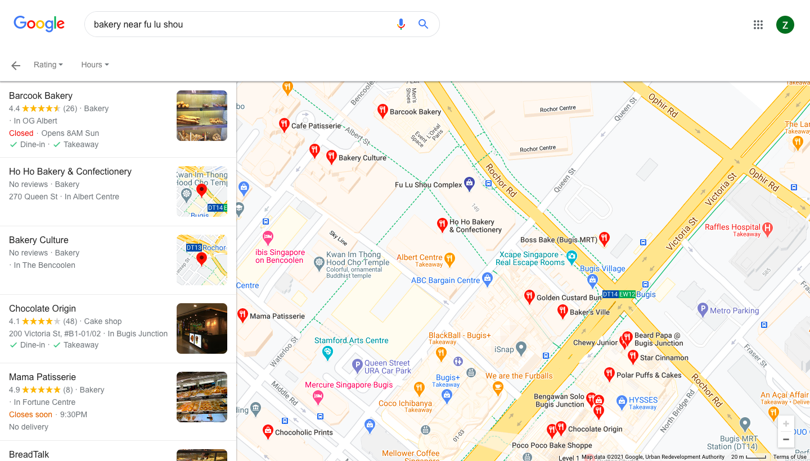

# Birthday Surprise C - No Place Like Home
### TEAM NAME: NYCP

## CATEGORY
OSINT

## DESCRIPTION
Great! Now this might sounds bad, but I have no clue where he lives. Can you help me find out where?

Flag format: `WH2021{postal_code}`

## FLAG
`WH2021{189646}`

## WRITEUP
From the previous OSINT challenge, there was a [pastebin](https://pastebin.com/y9wisLHg) link in the TikTok profile. At first, we thought that the text in the pastebin had hidden clues on how to approach this challenge, but after an hour, we decide that it was a red herring and we decided to search for Andrew's other social media account.

Since this challenge deals with locations, we should look for photos, videos or geotags that can give away one's location. Some common social media platforms that allows geotagging includes Instagram, Facebook and Strava. We find that Andrew has a [Instagram](https://www.instagram.com/andrewybh1997/) account by searching `andrewybh1997` on Google.

Some information that we can gather from his Instagram:
* There are shophouses nearby his house since he had his supper there ([Insta story](Images/instastory.jpg))
* He lives near a Downtown Line/ Circle Line MRT station since Gardens by the Bay is a few stops away ([Insta post #1](Images/insta1.jpg))
* There is a bakkwa, bakery and possibly a salted egg place below his place ([Insta post #2](Images/insta2.jpg) & [comments](Images/insta2_comments.jpg))
* He frequents Fu Lu Shou Complex ([Insta post #3](Images/insta3.png))

From all these information, we can conclude that he lives near Fu Lu Shou Complex, since it is near Bugis MRT station on the Downtown Line. The area also has some shophouses and residential buildings (we can get this info from Google Street View).

We can make use of Google Search to pinpoint his address.

We compare the bakkwa and salted egg searches to narrow our search to the following buildings:
1. The Bencoolen
2. Albert Centre
3. Bugis+
4. Bugis Junction

Of these 4 locations, only The Bencoolen has residences. Hence, we get the flag `WH2021{189646}`.
