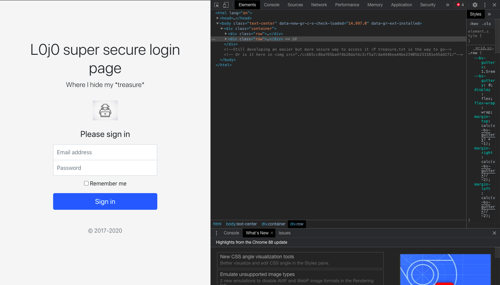
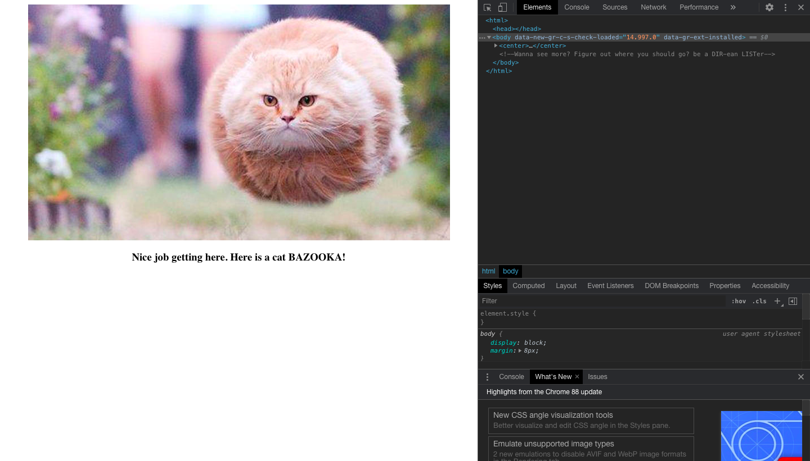
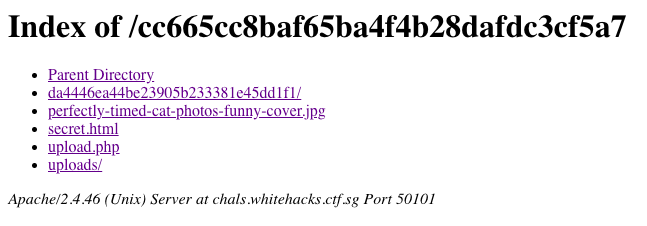
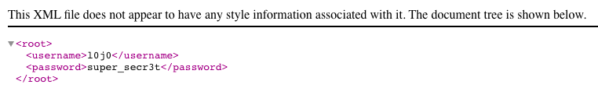
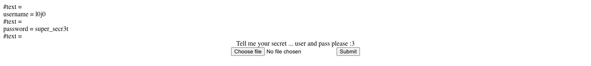
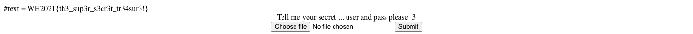

# X marks Louis's treasure
### TEAM NAME: NYCP

## CATEGORY
Web

## DESCRIPTION

## FLAG
`WH2021{th3_sup3r_s3cr3t_tr34sur3!}`

## WRITEUP
We are greeted with a login page. I was stuck on this log in page for a very long time, thinking that it is a SQL injection challenge, but turns out the only thing I had to do was to inspect element.

As expected, `/treasure.txt` is a red herring.

`./cc665cc8baf65ba4f4b28dafdc3cf5a7/da4446ea44be23905b233381e45dd1f1` is more promising and brings us to the following webpage:

Following the trail:

Going to the directory list `./cc665cc8baf65ba4f4b28dafdc3cf5a7/`:

We then go to `uploads/` which gives us a XML file (red herring again, login page wants email and password)

We then explore the `upload.php` page.

I tried to upload a random JPG image that I had on my computer and it returned some XML error message (Sorry, no screenshot). I suspected that the web app is vulnerable to XXE Injection and I uploaded the [payload](./payload.txt).

Flag:

